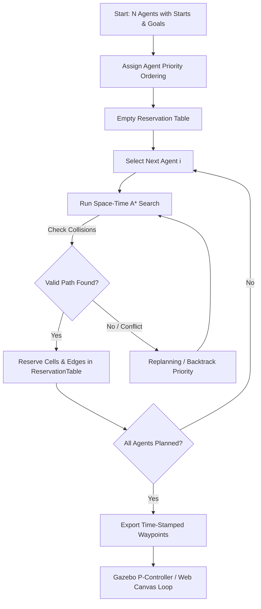

# Multi-Agent Path Finding (MAPF) Simulation Suite 🤖🚀

[](https://docs.ros.org/en/humble/)
[](https://gazebosim.org/)
[](https://www.python.org/)
[](https://developer.mozilla.org/en-US/docs/Web/API/Canvas_API)
[](LICENSE)

An end-to-end, high-performance simulation platform for **Multi-Agent Path Finding (MAPF)** designed to plan collision-free space-time trajectories for large fleets of autonomous mobile robots (**up to 100+ agents**). 

The repository provides a dual-platform architecture:
1. **Interactive Web Simulator** (`multi-agent-pathfinding/`): Instant 60 FPS HTML5 Canvas visualizer with real-time conflict metrics, space-time reservation debugging, and interactive obstacle painting.
2. **Robotic Simulation Stack** (`mapf_ros2_ws/`): Full ROS 2 Humble + Gazebo 11 simulation with differential-drive robot kinematics, closed-loop P-controller trajectory tracking, and RViz 3D marker visualization.

---

## 📑 Table of Contents

- [Overview & Problem Statement](#-overview--problem-statement)
- [Algorithmic Foundations](#-algorithmic-foundations)
- [Repository Structure](#-repository-structure)
- [Quick Start Guide](#-quick-start-guide)
  - [1. Running the Interactive Web Simulator](#1-running-the-interactive-web-simulator)
  - [2. Running the ROS 2 + Gazebo Simulator](#2-running-the-ros-2--gazebo-simulator)
- [ROS 2 Architecture & Topic Interface](#-ros-2-architecture--topic-interface)
- [Configuration & Tuning](#-configuration--tuning)
- [How to Push This Repository to GitHub](#-how-to-push-this-repository-to-github)
- [Troubleshooting & FAQ](#-troubleshooting--faq)

---

## 🧠 Overview & Problem Statement

**Multi-Agent Path Finding (MAPF)** is the fundamental challenge of coordinating paths for multiple autonomous agents from their respective start coordinates to target destinations on a shared grid while strictly guaranteeing:
1. **No Vertex Collisions**: Two robots cannot occupy the same coordinate $(x, y)$ at the same time step $t$.
2. **No Edge / Swap Collisions**: Two robots cannot traverse the same edge in opposite directions at the same time step (i.e., agent $A$ moves from $u \to v$ while agent $B$ moves from $v \to u$ at time $t$).
3. **Kinematic Feasibility**: Velocity and angular rate limits for differential-drive ground platforms.

MAPF is computationally **NP-hard** to solve optimally. This project implements a scalable decoupled approach combining **Priority-Based Search (PBS)** and **Space-Time A\*** capable of resolving 100 agents in under a second.

---

## ⚙️ Algorithmic Foundations



### 1. Space-Time A\* ($A^*(x, y, t)$)
- Explores a 3D state space $(x, y, t)$, where each node represents a spatial position at a discrete timestep.
- Available actions: `Move(North, South, East, West)` or `Wait()` in place.
- Heuristic: Admissible Manhattan distance $h(x, y) = |x - x_{goal}| + |y - y_{goal}|$.

### 2. Space-Time Reservation Table
Maintains occupied state records:
- **Vertex Bookings**: Set of pairs `((x, y), t)`
- **Edge Bookings**: Set of directed transitions `((u, v), t)` preventing head-on swaps `((v, u), t)`.

### 3. Closed-Loop Kinematics (ROS 2 / Gazebo)
Each differential-drive robot tracks discrete waypoints $(x_w, y_w)$ via a continuous proportional steering and velocity controller:
$$\theta_{\text{target}} = \text{atan2}(y_w - y_{\text{robot}}, x_w - x_{\text{robot}})$$
$$\omega = K_p \cdot \text{normalize}(\theta_{\text{target}} - \theta_{\text{robot}})$$
$$v = v_{\text{max}} \cdot \max(0, \cos(\theta_{\text{target}} - \theta_{\text{robot}}))$$

---

## 📂 Repository Structure

```
.
├── README.md                      # Comprehensive project guide (this document)
├── .gitignore                     # Git rules (excludes ROS 2 build/install artifacts)
├── launch_web.sh                  # One-line launcher for Web Simulator
├── launch_ros.sh                  # One-line launcher for ROS 2 + Gazebo Simulator
│
├── multi-agent-pathfinding/       # 🌐 Interactive Web Simulator
│   ├── index.html                 # Modern glassmorphic UI dashboard
│   ├── launch.sh                  # Web server bootstrap script
│   ├── css/
│   │   └── style.css              # Cyberpunk / slate dark-mode styling
│   └── js/
│       ├── grid.js                # Grid representation & obstacle generation
│       ├── astar.js               # Space-Time A* & reservation table
│       ├── agent.js               # Agent state machine & kinematics
│       ├── mapf.js                # Multi-agent coordination coordinator
│       ├── renderer.js            # HTML5 Canvas 60 FPS rendering engine
│       ├── ui.js                  # Control panel & live charts
│       └── main.js                # App entrypoint
│
└── mapf_ros2_ws/                  # 🤖 ROS 2 Humble + Gazebo 11 Workspace
    ├── install_ros.sh             # Automated ROS 2 & Gazebo installation script
    ├── build.sh                   # Colcon workspace build helper
    ├── run.sh                     # Full simulation launcher
    └── src/
        └── mapf_ros/
            ├── package.xml        # ROS 2 package manifest
            ├── setup.py           # Python package definition
            ├── launch/
            │   └── mapf_full.launch.py   # Master launch: Gazebo + RViz + Nodes
            ├── worlds/
            │   └── mapf_world.world      # Gazebo physics world
            ├── config/
            │   └── mapf_params.yaml      # Simulation parameters
            ├── rviz/
            │   └── mapf.rviz             # Pre-configured RViz visualization
            └── mapf_ros/
                ├── core/                 # Pure MAPF algorithms (Zero ROS deps)
                │   ├── grid.py
                │   ├── astar.py
                │   ├── agent.py
                │   └── mapf_coordinator.py
                ├── mapf_planner_node.py     # Trajectory computation node
                ├── agent_controller_node.py # Velocity P-controller node
                └── world_spawner_node.py    # Gazebo robot / obstacle spawner
```

---

## 🚀 Quick Start Guide

### 1. Running the Interactive Web Simulator

The web simulator requires zero external dependencies—only Python 3 to serve static files.

#### Launch Command:
```bash
./launch_web.sh
```
*(Or navigate to `multi-agent-pathfinding/` and run `python3 -m http.server 8080`)*

Then open your browser at:
```
http://localhost:8080
```

#### Controls & Features:
- **Agent Count**: Slider from 2 up to 100+ agents.
- **Grid Size**: Adjust from 10×10 to 60×60.
- **Obstacle Density**: Random procedural maze/cluttered obstacles.
- **Interactive Painting**: Click & drag on the grid to add/remove walls dynamically.
- **Playback Controls**: Play, Pause, Step-Forward, Reset, and Speed Slider (1x to 10x).
- **HUD Metrics**: Real-time compute time (ms), total makespan, sum of costs, and zero-conflict verification.

---

### 2. Running the ROS 2 + Gazebo Simulator

Simulate differential-drive robots with real physics, collision geometry, and sensor topics in Gazebo 11.

#### Prerequisites (Ubuntu 22.04 LTS):
If you have not installed ROS 2 Humble yet, run the automated setup script:
```bash
cd mapf_ros2_ws
chmod +x install_ros.sh && ./install_ros.sh
```
*(Requires `sudo` permissions; installs `ros-humble-desktop`, `gazebo_ros_pkgs`, and build tools).*

#### Step 1: Build the Workspace
```bash
cd mapf_ros2_ws
chmod +x build.sh && ./build.sh
```

#### Step 2: Launch the Simulation
From the repository root or inside `mapf_ros2_ws`:
```bash
./launch_ros.sh
```

Or run with custom agent counts and grid dimensions:
```bash
# Syntax: ./mapf_ros2_ws/run.sh <AGENTS> <GRID_SIZE> <OBSTACLE_PERCENT>
./mapf_ros2_ws/run.sh 20 15 10
```

This will concurrently launch:
1. **Gazebo 11 GUI** with dynamic obstacle walls and robot models.
2. **RViz2** displaying planned global trajectories and goal markers.
3. **Planner Node** (`mapf_planner_node`): Solves space-time trajectories.
4. **Agent Controllers** (`agent_controller_node`): Publishes `/agent_{i}/cmd_vel`.

---

## 📡 ROS 2 Architecture & Topic Interface

### Active Nodes:
- **`mapf_planner`**: Discretizes map, runs Space-Time A* for all robots, and broadcasts coordinated plans.
- **`agent_controller`**: High-frequency closed-loop node tracking waypoints using odometry feedback.
- **`world_spawner`**: Dynamic SDF spawner interfacing with Gazebo's `/spawn_entity` service.

### ROS 2 Topic Table:

| Topic | Type | Description |
|-------|------|-------------|
| `/mapf/grid_map` | `nav_msgs/OccupancyGrid` | Global 2D obstacle representation |
| `/mapf/agent_{i}/plan` | `nav_msgs/Path` | Discrete space-time path for robot $i$ |
| `/mapf/status` | `std_msgs/String` (JSON) | Live fleet telemetry (makespan, arrived, conflicts) |
| `/mapf/visualization` | `visualization_msgs/MarkerArray` | 3D goal positions & color-coded paths in RViz |
| `/agent_{i}/cmd_vel` | `geometry_msgs/Twist` | Linear ($v_x$) and angular ($\omega_z$) velocities |
| `/agent_{i}/odom` | `nav_msgs/Odometry` | Real-time position and orientation feedback |
| `/mapf/trigger_replan` | `std_msgs/Bool` | Trigger dynamic runtime replanning |

#### Inspect Topics in Real-Time:
```bash
# Sourcing ROS 2 environment
source /opt/ros/humble/setup.bash
source mapf_ros2_ws/install/setup.bash

# Monitor live status stream
ros2 topic echo /mapf/status

# List all active robot velocity topics
ros2 topic list | grep cmd_vel
```

---

## 🎛️ Configuration & Tuning

Simulation parameters can be tuned in `mapf_ros2_ws/src/mapf_ros/config/mapf_params.yaml`:

```yaml
mapf_planner:
  ros__parameters:
    agent_count: 20          # Number of concurrent robots
    grid_size: 20            # Grid dimensions (N x N)
    obstacle_density: 0.12   # Percentage of blocked cells (0.0 to 0.3)
    time_limit: 10.0         # Planning timeout in seconds
    max_time_steps: 256      # Maximum space-time horizon

agent_controller:
  ros__parameters:
    linear_speed: 0.5        # Max linear velocity (m/s)
    angular_speed: 1.5       # Max rotational velocity (rad/s)
    goal_tolerance: 0.15     # Waypoint arrival threshold (m)
    kp_linear: 1.0           # Proportional translation gain
    kp_angular: 2.0          # Proportional orientation gain
```

---

## 📤 How to Push This Repository to GitHub

Follow these steps to push this complete project to your personal GitHub account:

### Step 1: Initialize Git and Commit All Files
Open your terminal in the root directory of this project:

```bash
cd /home/udhav/.gemini/antigravity-ide/scratch

# Initialize git repository
git init -b main

# Set your git identity (if not already set)
git config user.name "Your Name"
git config user.email "your.email@example.com"

# Check status (notice build/ and install/ are automatically excluded by .gitignore)
git status

# Stage all files
git add .

# Create the initial commit
git commit -m "feat: initial commit of MAPF multi-agent pathfinding simulation suite"
```

### Step 2: Create a New Repository on GitHub
1. Go to [github.com/new](https://github.com/new).
2. Set **Repository name** (e.g., `multi-agent-pathfinding` or `mapf-fleet-simulator`).
3. Set visibility to **Public** (or **Private**).
4. **Important**: Leave "Add a README file", "Add .gitignore", and "Choose a license" **UNCHECKED** (we already created them locally).
5. Click **Create repository**.

### Step 3: Link Remote and Push
Copy the repository URL from GitHub and execute:

```bash
# Link the remote (replace with your actual GitHub username and repository name)
git remote add origin https://github.com/<YOUR-USERNAME>/<YOUR-REPO-NAME>.git

# Push to GitHub
git push -u origin main
```

*(If prompted for authentication, use your GitHub Personal Access Token or SSH keys).*

---

## ❓ Troubleshooting & FAQ

**Q: Why do I get `Package 'mapf_ros' not found` when launching ROS 2?**  
A: You must source both the base ROS 2 setup and the local workspace overlay:
```bash
source /opt/ros/humble/setup.bash
source /path/to/mapf_ros2_ws/install/setup.bash
```
The `./launch_ros.sh` and `./mapf_ros2_ws/run.sh` scripts handle this sourcing automatically.

**Q: Can I run more than 100 agents?**  
A: Yes! On the web simulator, you can increase the agent count directly. In Gazebo, simulating >50 individual physics bodies with contacts requires a dedicated GPU; for large-scale fleets (100+ to 500 agents), use the web simulator or run Gazebo in headless mode (`gui:=false`).

---

## 📜 License
This project is licensed under the MIT License — see the [LICENSE](LICENSE) file for details.
